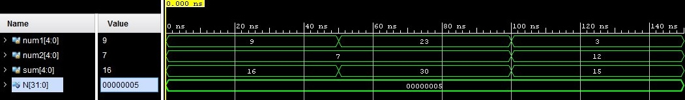

    N bit adder

In this repository locate a project that describe in System Verilog N bit adder.  

# N-bit adder
An N-bit adder is a device that takes two N-bit numbers as input and calculates their sum. This device works with unsigned digits.

# Timing diagram

