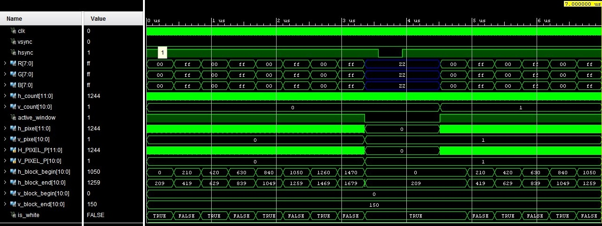

    VGA — Video Graphics Array

In this repository locate a project that describe in VHDL VGA interface.  

#  Video Graphics Array
VGA is a complex video interface used in monitors and video adapters.

The VGA video adapter uses an analog signal to transmit color information.

VGA uses two synchronization signals: the horizontal sync pulse (**HSYNC**) and the vertical sync pulse (**VSYNC**). These signals are necessary to precisely coordinate the display of pixels on the screen.

HSYNC determines the beginning and end of each line of the image.

VSYNC determines the beginning and end of each frame of the image.

This interface is implemented for a resolution of 1680 by 1050 and 8-bit color data. Also, the actual bit depth of the color channels is limited to 5 bits for red and blue, and to 6 bits for green.

This module was tested on the ZYNQ Z-7000 FPGA, the results are presented below.

<video controls src="img/VGA-test-on-ZYBO.mp4" title="
"></video>

# Timing diagram

