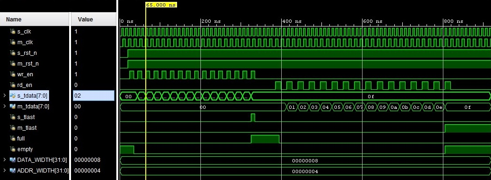

    FIFO — First Input First Output

In this repository locate a project that describe in System Verilog of async FIFO.  

# Asynchronous FIFO
Asynchronous (dual-synchronous) *FIFO* allows reading and writing transactions to be performed in different time domains (using different *clk* signals).

Features of the asynchronous *FIFO* scheme:
- writing to the *FIFO* is performed on the edge of the *clk* write signal, while the read transaction is asynchronous;
- the counters have a bit width one more than the bit width of the memory address; the most significant bit is used to indicate counter overflow;
- the *full* and *empty* signals use synchronized signals and are defined as follows:
``` systemverilog
full <= (s_cnt [CNT_W-1] != m_cnt_sync[CNT_W-1] ) &
(s_cnt [CNT_W-2:0] == m_cnt_sync[CNT_W-2:0]);
empty <= (s_cnt_sync[CNT_W-1:0] == m_cnt [CNT_W-1:0]);
```
# Schematic


# Timing diagram

