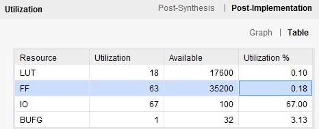
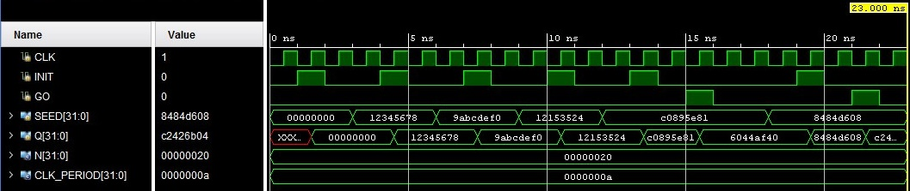

    LFSR — Linear Feedback Shift Register

In this repository locate a project that describe in System Verilog LFSR generator 
for an M-sequence (deg($\varphi$(x)) = N) based on the Fibonacci scheme.

The polynomial chosen was: 80000923h. Thus, we obtained:
$$φ(x) = x^{32} + x^{12} + x^9 + x^6 + x^2 + x^1 + 1$$

The device has the following interface and behavioral model of the n-bit generator:
- CLK – synchronization signal input (rising edge);
- INIT – synchronous initialization signal input (active high);
- SEED – initial state n-bit input bus;
- GO – new M-sequence symbol generation enable signal input (active high);
- Q – M-sequence symbol output n-bit bus.

# Mode
This device operates in 3 modes:
| **INIT** | **GO** | **CLK** | **SEED** | **Q(t)** | **Q(t+1)** | **Mode**        |
|:--------:|:------:|:-------:|:--------:|:--------:|:----------:|:----------------:|
| 0        | 0      | X       | X        | q(t)     | q(t)       | Store         |
| 0        | 1      | ↑       | X        | q(t)     | q(t+1)     | Generation    |
| 1        | X      | ↑       | s        | q(t)     | s          | Initialization    |

# Implementation results

# Timing diagram

# Tcl console
Testing sync initialization: TestVector = 00000000

Sync initialization successful: 00000000

Testing sync initialization: TestVector = 12345678

Sync initialization successful: 12345678

Testing sync initialization: TestVector = 9abcdef0

Sync initialization successful: 9abcdef0

Testing sync initialization: TestVector = 12153524

Sync initialization successful: 12153524

Testing storage mode: RandomSeed = c0895e81

Storage mode successful: 6044af40, 6044af40

Testing generation mode: TestVector = 8484d608

Generation successful: 8484d608, 8484d608
