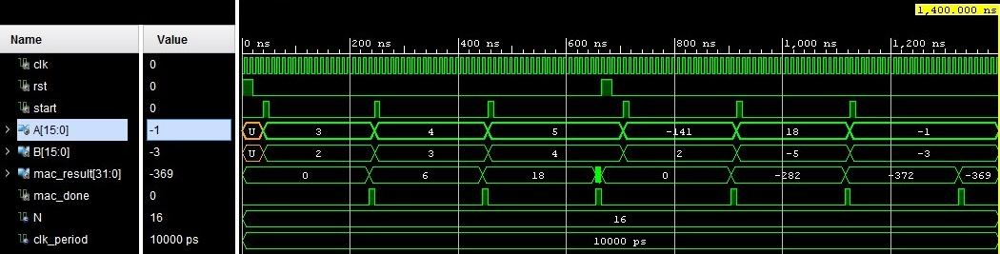

    MAC — Multipal-Accumulate Core

In this repository locate a project that describe in System Verilog MAC.  

The MAC processor is implemented on the basis of 3 devices: a control unit, an adder with an accumulation register, and a multiplier.

# Control unit
The control unit processes all control signals and implements correct communication between the blocks. 16-bit numbers with the sign 𝐴 and 𝐵 are sent to the input of the MAC core. Upon receipt of the leading edge of the start signal, the MAC core starts working. The multiplier (start_mpy) is started. When the product P is calculated (the ready signal is generated), the control unit generates a signal to write to the accumulator register (the write_acc signal), and in the next cycle, a signal is generated about the execution of the multiplication and accumulation operation (ready_mac). If necessary, the MAC core can be reset to zero using the rst signal. All actions in the MAC core are coordinated by the control unit, which is started by the start signal.

# Adder
The adder with the accumulation register, upon receipt of the write_acc signal, adds the product input and the current value of the register.

# Multiplier
Multiplication, starting from the least significant digits of the multiplier, with a shift of the sum of partial products to the right with the multiplicand fixed.

# In the future 

The device operates in 20 cycles. In the future, it is necessary to reduce this indicator by improving the operation of the control device and preparing the multiplier data.

# Timing diagram

