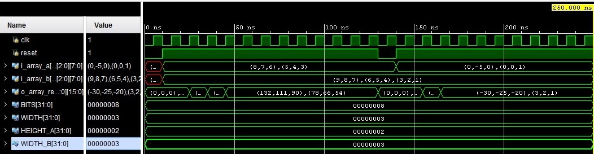

    Matrix Multiplication

In this repository locate a project that describe in System Verilog of matrix multiplication device.  

# Matrix Multiplier
A matrix multiplier is a device that takes 2 matrices as input. Then, using the MAC operation, the product of these matrices is calculated.

You can configure the data bit depth, as well as the matrix dimension. In accordance with these parameters, the required number of MAC blocks is generated to calculate the product.

# Timing diagram

