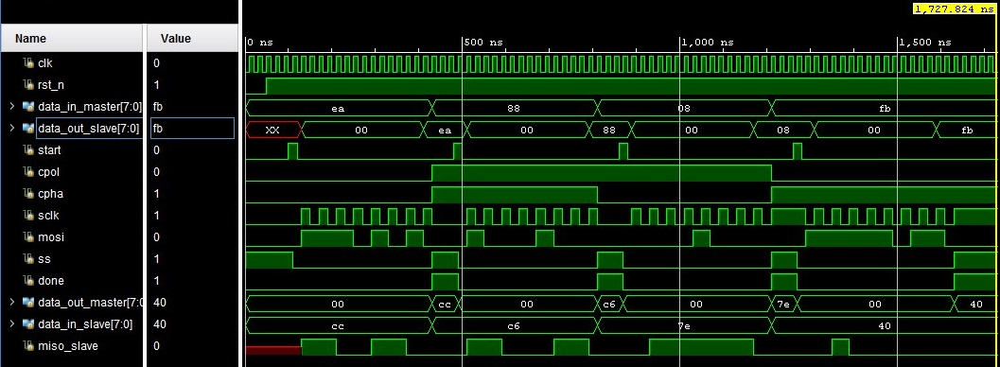

    SPI — Serial Peripheral Interface

In this repository locate a project that describe in System Verilog SPI interface.  

**Serial Peripheral Interface** is a serial, synchronous, full-duplex data transfer standard designed to provide simple, low-cost, high-speed interfacing between microcontrollers and peripherals.

# Basic SPI signals:

1. **SCLK (Serial Clock)**: A clock signal that is generated by the master device. All devices are synchronized with this signal.
2. **MOSI (Master Out Slave In)**: Data line from master to slave.
3. **MISO (Master In Slave Out)**: Data line from slave to master.
4. **SS (Slave Select)**: Slave select line. When it is active (usually logic 0), the slave device responds to signals from the bus.

# SPI Operation Principle

SPI operates on the principle of synchronous data transfer, where the master generates the clock signal and controls the data exchange process. The basic scheme of operation is as follows:

1. **Initialization**: The master activates one or more slave devices using the **SS** signal. The remaining slave devices ignore all signals until they are selected.
2. **Data Transfer**: At each edge of the **SCLK** clock signal, the master and slave simultaneously transmit and receive data bits:
- The master transmits data through the **MOSI** line, the slave receives it.
- The slave transmits its data through the **MISO** line, the master receives it.
3. **Full Cycle**: One full data transfer cycle involves sending and receiving one data bit per clock period. One byte of data is transferred per 8 clock cycles.

# Timing diagram
