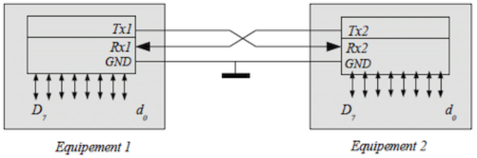
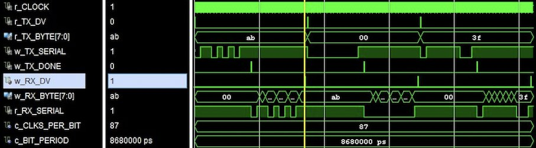

    UART — Universal Asynchronous Receiver/Transmitter

In this repository locate a project that describe in VHDL UART interface.  

#  Universal Asynchronous Receiver/Transmitter
Universal Asynchronous Receiver/Transmitter is a standard serial data transmission technology used to exchange information between devices.

Each bit of each byte is transmitted in an equal allotted period of time (in fact, a time slot). The standard size of data in a package is 8 bytes, but in addition to data, each packet also carries service information, namely:

– **start bit** (Required)

– **stop bit** (Also required, 1 or 2 stop bits can be used)

– **parity bit** (Optional. Available in Odd, Even types).

# Timing diagram

